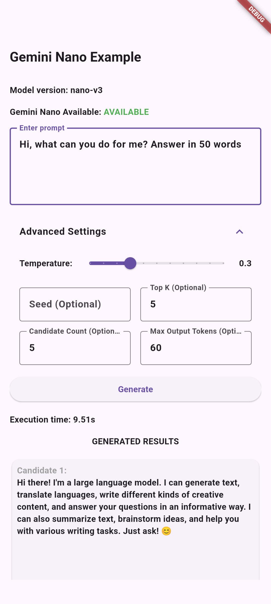

# Gemini Nano for Android

[](https://pub.dev/packages/gemini_nano_android)
[](https://github.com/Piero16301/gemini_nano_android/actions)
[](https://github.com/Piero16301/gemini_nano_android)
[](https://opensource.org/licenses/MIT)

A Flutter plugin to access **Gemini Nano**, Google's most efficient on-device AI model, directly through Android AI Core

This package enables **offline-first**, latency-free, and privacy-centric generative AI features by bridging Flutter with the native Android AICore (via ML Kit).

## ✨ Features

* **100% Offline Inference:** Process data without an internet connection.
* **Privacy Focused:** Data never leaves the device.
* **Zero Latency:** No network round-trips; utilizes the on-device NPU (Pixel Tensor / Snapdragon).
* **Cost Efficient:** Save on cloud API tokens by offloading simple tasks to the device.

## 📸 Example App




## 📱 Supported Devices

Gemini Nano via AI Core is currently available on select flagship Android devices, including but not limited to:

* **Google:** Pixel 10, Pixel 10 Pro, Pixel 10 Pro XL, Pixel 10 Pro Fold, Pixel 9, Pixel 9 Pro, Pixel 9 Pro XL, Pixel 9 Pro Fold
* **Honor:** Honor 400 Pro, Magic 6 Pro, Magic 6 RSR, Magic 7, Magic 7 Pro, Magic V3, Magic V5
* **iQOO:** iQOO 13
* **Motorola:** Razr 60 Ultra
* **OnePlus:** OnePlus 13, OnePlus 13s, OnePlus Pad 3
* **OPPO:** Find N5, Find X8, Find X8 Pro, Reno 14 Pro
* **POCO:** POCO F7 Ultra, POCO X7 Pro
* **realme:** realme GT 7 Pro, realme GT 7T
* **Samsung:** Galaxy S25, Galaxy S25+, Galaxy S25 Ultra, Galaxy Z Fold7
* **vivo:** vivo X200, vivo X200 Pro, vivo X Fold3 Pro, vivo X Fold5
* **Xiaomi:** Xiaomi 15 Ultra, Xiaomi 15, Xiaomi 15T Pro, Xiaomi 15T, Xiaomi Pad Mini

*Note: The user must have "AI Core" installed and updated via the Google Play Store.*

## 🛠 Installation

Add the dependency to your `pubspec.yaml`:

```yaml
dependencies:
  gemini_nano_android: ^0.0.1
```

## ⚙️ Android Configuration
Ensure your android/app/build.gradle defines a minimum SDK version compatible with modern AI features (API 26+ recommended):

```gradle
android {
    defaultConfig {
        minSdkVersion 26
    }
}
```

## 🚀 Usage
### 1. Basic Text Generation
The simplest way to generate text.

```dart
import 'package:gemini_nano_android/gemini_nano_android.dart';

void generateText() async {
  try {
    // Check if the device supports Gemini Nano
    bool isAvailable = await GeminiNanoAndroid.isAvailable();
    
    if (isAvailable) {
      String result = await GeminiNanoAndroid.generate("Explain quantum physics in 10 words.");
      print("Gemini Nano says: $result");
    } else {
      print("Gemini Nano is not supported or not installed on this device.");
    }
  } catch (e) {
    print("Error generating text: $e");
  }
}
```

### 2. The "Hybrid Cloud-Fallback" Pattern (Recommended)
Since on-device models have limitations (context size, multimodal capabilities) or might not be downloaded yet, it is best practice to use a fallback strategy.

This example attempts to use Gemini Nano first (Free/Fast), and falls back to Firebase Vertex AI (Cloud) if it fails.

```dart
import 'package:gemini_nano_android/gemini_nano_android.dart';
// import 'package:firebase_vertexai/firebase_vertexai.dart'; // Uncomment if using Firebase

Future<String> smartProcess(String prompt) async {
  try {
    // 1. Try On-Device (Fast, Free, Private)
    print("Attempting local inference...");
    final result = await GeminiNanoAndroid.generate(prompt);
    return result;
    
  } catch (e) {
    // 2. Fallback to Cloud (More powerful, costs money, requires internet)
    print("Local inference failed ($e). Switching to Cloud...");
    
    // final model = FirebaseVertexAI.instance.generativeModel(model: 'gemini-1.5-flash');
    // final response = await model.generateContent([Content.text(prompt)]);
    // return response.text ?? "Error in cloud generation";
    
    return "Fallback placeholder: Cloud generation would happen here.";
  }
}
```

### 3. Structured Output (JSON) for Receipt Processing
Gemini Nano is great at cleaning up OCR text.

```dart
Future<void> processReceiptText(String ocrRawText) async {
  final prompt = """
    Extract data from this receipt text. 
    Return ONLY a JSON with keys: 'total', 'date', 'merchant'.
    Text: $ocrRawText
  """;

  final jsonResult = await GeminiNanoAndroid.generate(prompt);
  // Parse jsonResult...
}
```

## ⚠️ Troubleshooting & Limitations
Model Not Downloaded: The first time an app requests the model, Android AI Core needs to download it (approx. 1GB+). This happens in the background. If you get a Model not found error, ensure the device is on Wi-Fi and charging, then try again later.

Multimodal Support: Currently, the Android AICore implementation for 3rd party apps is primarily Text-to-Text. To process images (like PDFs or receipts), use google_mlkit_text_recognition to extract text first, then pass that text to GeminiNanoAndroid.

Context Window: On-device models have smaller context windows than cloud models. Keep prompts concise.

## 📄 License
Distributed under the MIT License. See LICENSE for more information.